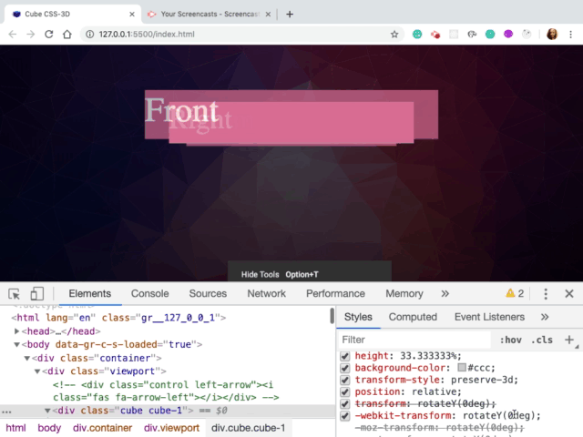
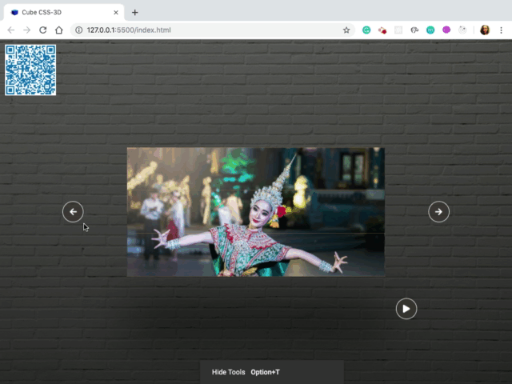
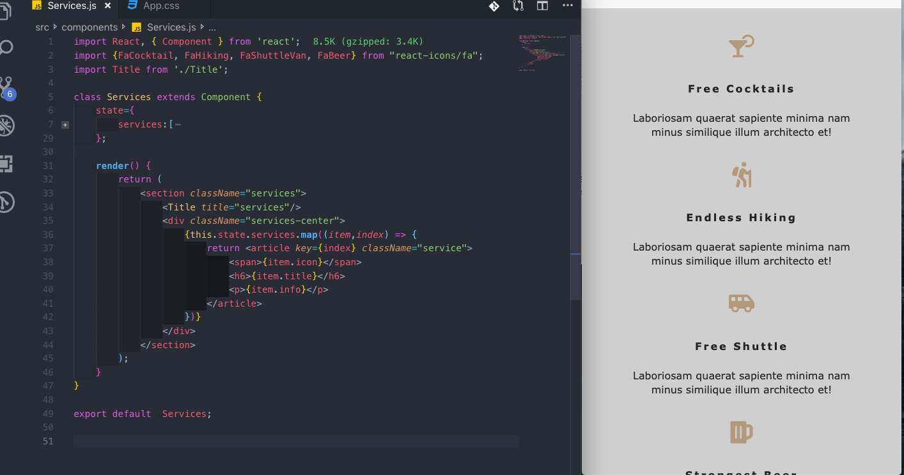

# #100DaysOfCode Log - Round 1 - [Kanjamad Bosel]

The log of my #100DaysOfCode challenge. Started on [June 13, Thursday, 2019].

## Log

### R1D1 (June 13,2019)
Started a basic CSS
* CSS(Cascading style sheets)
* Used to make our web projects awesome and beautiful so you can say CSS is responsible for styling
* What's really cool about CSS is the fact that just like with a HTML now we don't have to download anything to start using CSS and we can just start using CSS right away.

In general there are 3 ways how to start using CSS the 
1. inline 
2. internal  
3. external CSS.

---

### R1D2 (June 14,2019)
I will build nice profile card. Manipulate on backgrounds and create some cool effects. Project will be built based on HTML and CSS
* [Link to project hosted on Github](https://github.com/kanjamad/Invisible-Card)

---

### R1D3 (June 15,2019)
Finish create a profile card base on HTML CSS. It was an interesting project and I learned some more cool CSS.
* [Link to project hosted on Github](https://github.com/kanjamad/Invisible-Card)
* [Link to project hosted on Netlify](https://card-profile-kanjamad.netlify.com/)


---

### R1D4 (June 16,2019) HaPpY Father's Day!!!!!!
* Animation + Invisibal-Card : Modify the last project by change background to be parallax effect Animation. 
* In this project I will use parallax effect Animation to build nice profile card and have multiple background capabilities. Project will be built based on HTML and CSS.
* Hover the astronaut image for 3s, 
* So when the 1st transition of white color of box shadow end. 
* Then after 0.5s the card will move down. 
* Card will display nicely. 
* Animate multiple background each layer is set to move different distances.
* Start background the furthest layer in the back is moving slowest.
* Then the star on top of that layer is moving a little bit faster.
* The planet rolls a long it's moving faster then both of star layers.
* Cool 3D depth perception.

* [Link to project hosted on Netlify](https://css-animate-card-profile.netlify.com/)
* [Link to project hosted on Github](https://github.com/kanjamad/Parallax-effect-Animation)


---
### R1D5 (June 17,2019)
Learning CSS transform and play with it.
* <a href="https://codepen.io/team/css-tricks/pen/ebb6b5a5cec86aa04168f03e26c7501c" target="_blank">CSS transform</a>

___

### R1D6 (June 18,2019)
Learning CSS transform property

* <a href="https://codepen.io/team/css-tricks/pen/ebb6b5a5cec86aa04168f03e26c7501c" target="_blank">CSS transform</a>
* <a href="https://www.youtube.com/watch?v=wmAP2xvNs08&t=932s" target="_blank">CSS Positioning Tutorial for Beginners</a>
* <a href="https://www.youtube.com/watch?v=N5EW4HnF6FU&t=24s" target="_blank">The Only 2 CSS Properties You Should Animate</a>

___

### R1D7 (June 19,2019)

* Create Rotate 3 cube by click on left arrow. 
* ES6 Cover it back to an Array using; Array.from() or using the spread operator ...
* Loop : forEach
* Transition nicer : use transition in style CSS because on 1st click is happend only one I indicated as a value just 90 degrees then on 2nd click is already rotated by 90 degrees.So that's why don't have other rotation.


```

   const cubes = document.querySelectorAll('.cube');
    console.log(cubes); //NodeList(3) [div.cube.cube-1, div.cube.cube-2, div.cube.cube-3]

    //ES6 Cover NodeList back to an Array using by using the spread operator ...
    var backToArray= [...cubes]
    console.log(backToArray); //(3) [div.cube.cube-1, div.cube.cube-2, div.cube.cube-3]

    //ES6 Cover NodeList back to an Array using Array.from()
    var array = Array.from(cubes)
    console.log(array); //(3) [div.cube.cube-1, div.cube.cube-2, div.cube.cube-3]

```
```
document.querySelector('.left-arrow').addEventListener('click', () => {
    // console.log("click on left")
    const cubes = document.querySelectorAll('.cube');
    console.log(cubes);
    [...cubes].forEach(cube => cube.style.transform = 'rotateY(90deg');
});

```
* style CSS : use different delay time 
```
.cube-1 {
    transition: transform .4s;
    -webkit-transition: transform .4s;
    -moz-transition: transform .4s;
    -ms-transition: transform .4s;
    -o-transition: transform .4s;
}

.cube-2 {
    z-index: 10;
    transition: transform .4s .2s;
    -webkit-transition: transform .4s .2s;
    -moz-transition: transform .4s .2s;
    -ms-transition: transform .4s .2s;
    -o-transition: transform .4s .2s;
}

.cube-3 {
    transition: transform .4s .4s;
    -webkit-transition: transform .4s .4s;
    -moz-transition: transform .4s .4s;
    -ms-transition: transform .4s .4s;
    -o-transition: transform .4s .4s;
}


```

* <a href="https://www.samanthaming.com/tidbits/43-3-ways-to-remove-array-duplicates" target="_blank">Convert it back to an Array </a>


___

### R1D8 (June 20,2019)
Review Program Structure. 

* <a href="http://eloquentjavascript.net/02_program_structure.html" target="_blank">Program Structure</a>

___


### R1D9 (June 21,2019)
* Went to event the @sfhtml5 
* Learn Declarative Reactive Web Components with LitElement

* <a href="https://www.youtube.com/watch?v=9FB0GSOAESo&t=3s" target="_blank">Declarative Reactive Web Components with Justin Fagnani</a>
___

### R1D10 (June 22,2019)
Learning more about CSS grid and working on React project


* <a href="https://css-tricks.com/snippets/css/complete-guide-grid/" target="_blank">A Complete Guide to Grid</a>
___