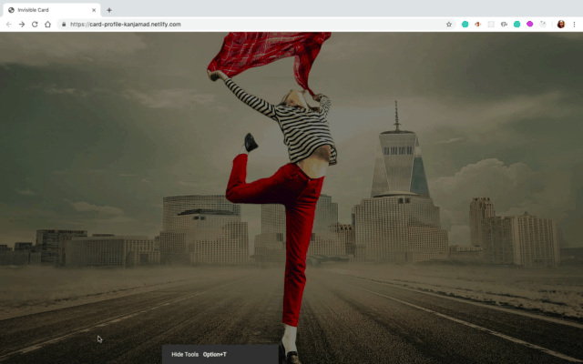

# #100DaysOfCode Log - Round 1 - [Kanjamad Bosel]

The log of my #100DaysOfCode challenge. Started on [June 13, Thursday, 2019].

## Log

### R1D1 (June 13,2019)
Started a basic CSS
* CSS(Cascading style sheets)
* Used to make our web projects awesome and beautiful so you can say CSS is responsible for styling
* What's really cool about CSS is the fact that just like with a HTML now we don't have to download anything to start using CSS and we can just start using CSS right away.

In general there are 3 ways how to start using CSS the 
1. inline 
2. internal  
3. external CSS.

---

### R1D2 (June 14,2019)
I will build nice profile card. Manipulate on backgrounds and create some cool effects. Project will be built based on HTML and CSS
* [Link to project hosted on Github](https://github.com/kanjamad/Invisible-Card)

---

### R1D3 (June 15,2019)
Finish create a profile card base on HTML CSS. It was an interesting project and I learned some more cool CSS.
* [Link to project hosted on Github](https://github.com/kanjamad/Invisible-Card)
* [Link to project hosted on Netlify](https://card-profile-kanjamad.netlify.com/)

---

### R1D4 (June 16,2019) HaPpY Father's Day!!!!!!
* Animation + Invisibal-Card : Modify the last project by change background to be parallax effect Animation. 
* In this project I will use parallax effect Animation to build nice profile card and have multiple background capabilities. Project will be built based on HTML and CSS.
* Hover the astronaut image for 3s, 
* So when the 1st transition of with color of box shadow end. 
* Then after 0.5s the card will move down. 
* Card will display nicely. 
* Animate multiple background each layer is set to move different distances.
* Start background the furthest layer in the back is moving slowest.
* Then the start on top of that layer is moving a little bit faster.
* The planet rolls a long it's moving faster then both of start layers.
* Cool 3D depth perception.

* [Link to project hosted on Netlify](https://css-animate-card-profile.netlify.com/)
* [Link to project hosted on Github](https://github.com/kanjamad/Parallax-effect-Animation)

---
